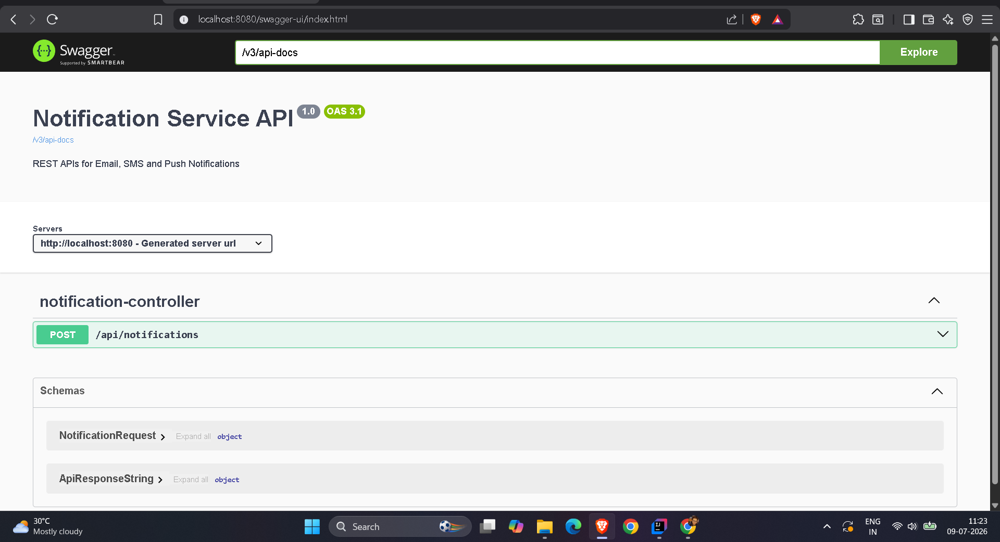
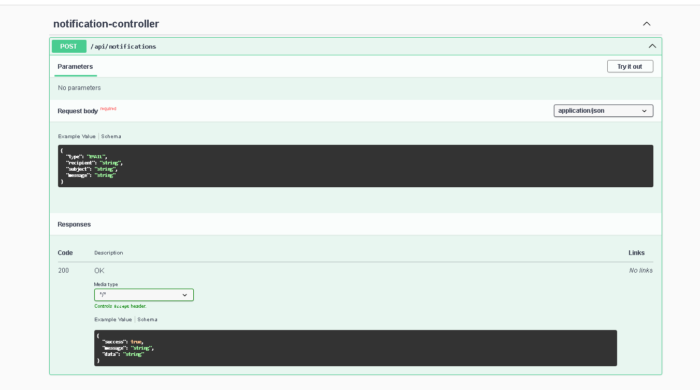
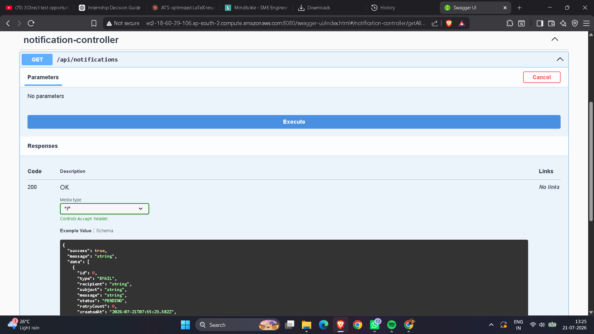
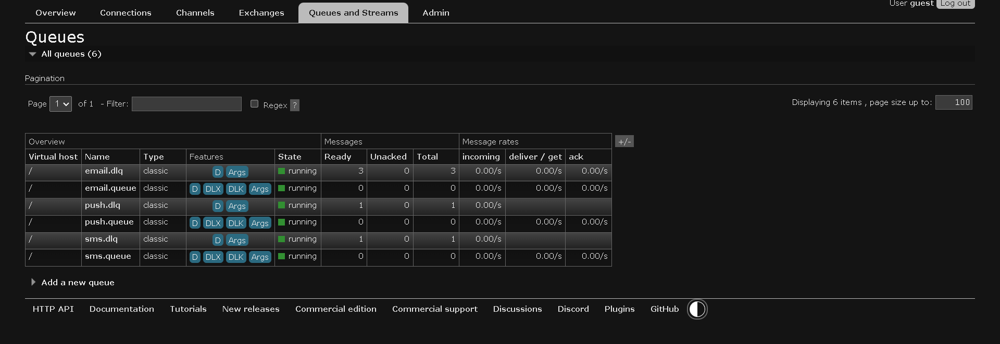
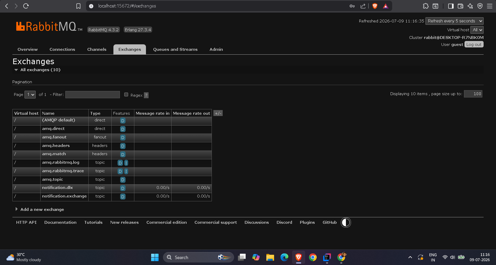

# Notification Service


A production-ready **Notification Service** built using **Java 21**, **Spring Boot 3.5**, and **RabbitMQ**.

The application demonstrates **asynchronous message processing** using RabbitMQ Topic Exchanges and supports **Email**, **SMS**, and **Push Notifications** with **Spring Retry**, **Dead Letter Queues (DLQ)**, **Docker**, **Swagger/OpenAPI**, and **GitHub Actions CI**.

---

## Overview

Notification Service is an event-driven backend application built with Java 21 and Spring Boot that demonstrates reliable asynchronous message processing using RabbitMQ.

The project supports Email, SMS, and Push notifications using Topic Exchange routing, Spring Retry, Dead Letter Queues (DLQ), RESTful APIs, Dockerized deployment, GitHub Actions CI, and deployment on AWS EC2.

## Key Highlights

- Event-driven architecture using RabbitMQ
- Topic Exchange based message routing
- Spring Retry with Dead Letter Queue (DLQ)
- Dockerized deployment with Docker Compose
- Deployed on AWS EC2
- RESTful APIs with Spring Boot
- Swagger/OpenAPI documentation
- GitHub Actions Continuous Integration
- Unit Testing with JUnit 5 and Mockito

## Features

- Asynchronous notification processing using RabbitMQ
- Email, SMS, and Push notification support
- Topic Exchange based message routing
- Spring Retry with automatic retry mechanism
- Dead Letter Queue (DLQ) support
- RESTful APIs built with Spring Boot
- Request validation using Jakarta Validation
- Swagger / OpenAPI documentation
- Docker & Docker Compose support
- PostgreSQL integration
- Deployed on AWS EC2 using Docker Compose
- Unit Testing with JUnit 5 and Mockito
- GitHub Actions Continuous Integration (CI)

---

## Tech Stack

| Technology | Version |
|------------|---------|
| Java | 21 |
| Spring Boot | 3.5.16 |
| Spring AMQP | 3.2.x |
| RabbitMQ | 4.x |
| Maven | 3.x |
| PostgreSQL | 17 |
| Docker | Latest |
| Docker Compose | Latest |
| AWS EC2 | Ubuntu |
| Springdoc OpenAPI | Latest |
| GitHub Actions | CI |
| JUnit 5 | Latest |
| Mockito | Latest |

---

## Architecture

```text
                    REST API
                        │
                        ▼
            Notification Controller
                        │
                        ▼
             Notification Producer
                        │
                        ▼
         RabbitMQ Topic Exchange
        ┌─────────┬─────────┬─────────┐
        ▼         ▼         ▼
   Email Queue  SMS Queue  Push Queue
        │         │          │
        ▼         ▼          ▼
 Email Consumer SMS Consumer Push Consumer
        │         │          │
        ▼         ▼          ▼
 Email Service  SMS Service  Push Service

          Spring Retry (3 Attempts)
                    │
                    ▼
        Dead Letter Exchange (DLX)
                    │
                    ▼
         Dead Letter Queue (DLQ)
```

Producer components publish notifications to a **RabbitMQ Topic Exchange**, where messages are routed to dedicated queues using routing keys. Each queue is consumed independently by its respective notification service (Email, SMS, or Push). Failed messages are automatically retried using **Spring Retry** before being redirected to the **Dead Letter Queue (DLQ)** for further analysis or manual processing.

---

## Screenshots

## Swagger UI

### API Overview

Interactive API documentation generated using Springdoc OpenAPI.



---

### Publish Notification Endpoint

Shows the request body, example payload and response documentation.



---

### Get Notifications Endpoint

Returns notification details through the REST API.



---

## RabbitMQ Dashboard

### Queues

Displays the primary queues and dead-letter queues.



---

### Exchanges

Displays the Topic Exchange and Dead Letter Exchange responsible for routing notifications.



---

## Project Structure

```text
src
├── main
│   ├── java
│   │   ├── config
│   │   ├── constants
│   │   ├── consumer
│   │   ├── controller
│   │   ├── dto
│   │   ├── enums
│   │   ├── exception
│   │   ├── producer
│   │   ├── response
│   │   └── service
│   └── resources
└── test
    └── java
```

---

## Running the Application
docker compose up -d --build

## Clone Repository

```bash
git clone https://github.com/UtkarshPardhi/notification-service.git

cd notification-service
```

## Build

```bash
mvn clean package
```

## Run with Docker

```bash
docker compose up --build
```

Application URL

```
http://localhost:8080
```

---

## Deployment

The application is successfully deployed on an AWS EC2 instance using Docker Compose. The Spring Boot application, RabbitMQ, and PostgreSQL run as Docker containers and communicate over an isolated Docker network.

## Deployment Environment

- AWS EC2 (Ubuntu)
- Java 21
- Spring Boot 3.5
- RabbitMQ
- PostgreSQL
- Docker
- Docker Compose

All services run as Docker containers and communicate over an isolated Docker network managed by Docker Compose.

## REST API

| Method | Endpoint | Description |
|--------|----------|-------------|
| POST | `/api/notifications` | Publish Email, SMS, or Push Notification |
| GET | `/api/notifications` | Retrieve notification details |

### Sample Request

```json
{
  "type": "EMAIL",
  "recipient": "user@example.com",
  "subject": "Welcome",
  "message": "Welcome to Notification Service"
}
```

---

# Swagger Documentation

```
http://localhost:8080/swagger-ui/index.html
```

---

# RabbitMQ Management

```
http://localhost:15672
```

Default Credentials

```
Username : guest
Password : guest
```

---

## Testing

Run all tests

```bash
mvn test
```

## Unit Test Coverage

The current unit test suite covers the following components:

- Notification Producer
- Email Consumer
- SMS Consumer
- Push Consumer
- Notification Controller

---

## Continuous Integration

This project uses **GitHub Actions** to automate Continuous Integration.

On every push and pull request, the CI pipeline:

- Builds the project
- Executes all unit tests
- Verifies build stability

Workflow

```text
.github/workflows/ci.yml
```

---

## Docker
docker compose up -d --build

### Build & Run

```bash
docker compose up --build
```

### Stop Containers

```bash
docker compose down
```

---

## Future Improvements

- SMTP Email Integration
- SMS Gateway Integration
- Firebase Cloud Messaging (FCM)
- Kubernetes Deployment
- Prometheus & Grafana Monitoring
- Centralized Logging
- Metrics & Health Checks
- Integration Testing using Testcontainers

---

## Author

**Utkarsh Pardhi**

MCA Graduate | Java Backend Developer

**Skills:** Java • Spring Boot • RabbitMQ • PostgreSQL • Docker • AWS EC2 • REST APIs • JUnit 5 • Mockito • GitHub Actions

---

## License

This project is intended for educational and portfolio purposes.

